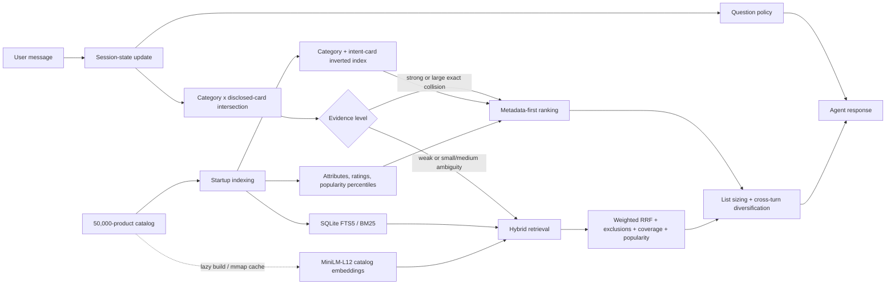

# TechJam Conversational E-Commerce Search Challenge

[日本語版 README](README_ja.md)

Build an AI shopping agent that asks useful follow-up questions and recommends the customer's hidden target product within at most 10 turns.

## What You Receive

- A frozen catalog of 50,000 products from the `Clothing_Shoes_and_Jewelry` category of Amazon Reviews 2023.
- 200 labeled public sessions for local development.
- A BM25 + Sentence-BERT hybrid starter agent and deterministic local evaluator.
- The Agent API contract and scoring rules.

The organizer keeps 800 additional sessions private for final evaluation.

## Task

For each session, your agent receives an anonymized preference profile and a short customer message. Raw user IDs, review text, timestamps, and purchase history are never disclosed. On every turn the agent may:

- ask a natural clarification question in `message` and identify one requested field in `ask_attribute`;
- return a ranked list of up to 10 catalog `parent_asin` values;
- do both in the same response.

The session ends when the target product appears in the scored Top 10 or after turn 10. Sessions cover Buying, Browsing, Intent Override, and Boundary behavior.

## How the Customer Simulator and Target Product Work

Each evaluation session has one target product fixed in advance. The public development target is stored
as `ground_truth.parent_asin` in `data/public_set.jsonl`; private targets and intent state are not passed to
the Agent. The Agent searches and recommends IDs from the downloaded 50,000-row `data/catalog.jsonl`.

The released customer side is a deterministic simulator rather than a free-form chat model. It derives
hard constraints and soft preferences from the target product's metadata. On later turns it uses the
Agent's structured `ask_attribute`—not semantic interpretation of `message`—to decide which undisclosed
constraint to return. Buying sessions reveal a constraint early, Browsing sessions start vague, Intent
Override sessions replace a preference on turn 3 or 4, and Boundary sessions may answer that they have no
preference. See [README_ja.md](README_ja.md) for the detailed flow and examples.

## Quick Start with Pixi

[Install Pixi](https://pixi.sh/latest/installation/), then run every command from the repository root:

```bash
pixi install
pixi run download-data
pixi run check
pixi run evaluate
```

Pixi creates and uses the locked Python environment automatically. The data task downloads the frozen
`catalog.jsonl.gz` from the `participant-kit` GitHub Release, verifies its published SHA-256 digest,
decompresses it to `data/catalog.jsonl`, and validates all 50,000 rows. It is safe to rerun; an existing
valid catalog is left in place. Use `pixi run download-data --force` only when you intend to replace it.

Available tasks:

| Task | Purpose |
| --- | --- |
| `pixi run download-data` | Download, checksum, decompress, and validate the catalog |
| `pixi run data-info` | Show dataset fields, types, row counts, and scenario counts |
| `pixi run validate-public-data` | Validate the committed 200-session public set |
| `pixi run validate-data` | Validate both the public set and downloaded catalog |
| `pixi run test` | Run unit tests |
| `pixi run check` | Run unit tests and validate both datasets |
| `pixi run runtime-check` | Verify the active Python, NumPy/BLAS, Torch, and device runtime |
| `pixi run evaluate` | Run the starter on the public set and write `results.json` |
| `pixi run evaluate-robustness` | Run the 40-session distribution-aware pseudo-private audit |
| `pixi run evaluate-offline-cpu` | Evaluate with CPU and Hugging Face offline mode enforced |

Python 3.10–3.13 and the Sentence Transformers/PyTorch dependencies are locked through `pixi.toml`.

Edit `starter/agent.py` to implement your system. Do not edit the evaluator or public labels when reporting your local score.
The command writes per-session results and aggregate metrics to `results.json`.
When comparing machines, share that generated file rather than copying the terminal summary: the file contains
all 200 per-session records, while the console intentionally omits them. Record the Git commit, data hashes,
`BERT_MODEL_NAME`, and `BERT_DEVICE`; a 40-session subset or robustness slice is not comparable to the public
200-session score.

The historical weak BM25 starter scores Hit Rate@10 `0.125`, MRR `0.068034`, and
MTTC `9.81` on the released public set. See `docs/baseline_results.json`.

## Distribution-aware robustness audit

The public labels have been used repeatedly during development, so the repository also includes a small
pseudo-private audit that excludes all 200 public target ASINs. It uses the official simulator unchanged and
constructs two 20-session suites with the exact 40/40/15/5 scenario mix:

- `matched` selects unseen catalog products matched to public targets on broad category, popularity, rating,
  price, metadata completeness, catalog cohort, and intent-card collision statistics;
- `collision_stress` keeps 12 matched targets and replaces 8 with the public set's uncovered
  `full-card candidate count > 50` blind spot. This slice is diagnostic and is not a private-score estimate.

Run the full 40-session audit with `pixi run evaluate-robustness`. To generate and inspect the deterministic
target manifest and calibration without loading the retrieval model, run:

```bash
pixi run python -m scripts.evaluate_robustness --skip-evaluation --output robustness_manifest.json
```

The checked-in run and interpretation are in `robustness_results.json` and
[`docs/robustness_evaluation.md`](docs/robustness_evaluation.md).

## Metadata-first hybrid strategy

The current system is a **metadata-first conversational retriever with a lexical/dense fallback**. It never
receives the target ASIN, ground-truth label, or evaluator state. It reconstructs searchable evidence from the
catalog and the messages supplied through the public Agent API.

### Runtime architecture



At startup, the Agent reads the catalog once and builds four reusable views:

- a weighted FTS5 index over title, category, features, details, store, and description;
- normalized product text plus regex-derived material, color, size, style, use-case, budget, brand, and feature values;
- a category/constraint inverted index and ordered intent-card sequence derived from product metadata;
- category-normalized review-count percentiles and ratings for deterministic tie-breaking.

The MiniLM catalog matrix is lazy: exact metadata paths can answer without loading the encoder. When semantic
retrieval is required, normalized float32 embeddings are built in batches, stored under `.cache/bert_embeddings/`,
and memory-mapped on later runs.

### Per-turn decision flow

1. **Update conversation state.** The Agent stores the new message, extracts positive and negative attributes,
   removes excluded/superseded terms from the retrieval query, and tracks products shown on earlier turns.
2. **Handle intent changes.** A preference correction removes only the superseded value and retains later valid
   constraints. A genuine `start over` clears messages, category, exclusions, questions, and recommendation history.
3. **Select a question.** Simulator-shaped openings normally receive one broad `other` question so the user can
   disclose the most useful constraint. Rich free-form requests with at least two detected attributes skip that
   redundant question. Remaining questions favor feature/material and maximize coverage and value diversity in
   the current BM25 Top 30. Exhausted non-protocol conversations return results without repeating a question.
4. **Build exact candidates.** The Agent intersects the detected category with every disclosed catalog-backed
   constraint, then labels the evidence `weak`, `medium`, or `strong`. Narrow-list optimizations require both a
   category and a released-simulator marker; merely saying “I'm looking for” is not enough.
5. **Choose a retrieval branch.** Strong evidence, and large exact collision sets, use the metadata-first path and
   can bypass MiniLM. Other cases run weighted BM25 Top 250 and full-catalog cosine Top 250, fused by RRF.
6. **Rank candidates.** Exact matches use constraint slot agreement, longest common subsequence, constraint span,
   retrieval score, category popularity, average rating, and a stable row-id tie-break. Hybrid results additionally
   use exclusion filtering, exact-card boost, positive-term coverage, and a small popularity prior. If noisy
   exclusions remove every hybrid candidate, the unfiltered ranking is retained instead of returning an empty list.
7. **Size and diversify the list.** A unique strong match returns one item. Early lists default to two items when
   confidence permits; collision sets widen according to unseen candidates and turns remaining. Turn 10 always
   allows the full requested Top K. Previously shown products move behind unseen products and are reused only as
   a fallback.

### Main ranking parameters

| Parameter | Default | Role |
| --- | ---: | --- |
| BM25 candidate count | 250 | lexical candidate pool |
| Dense candidate count | 250 | exact full-catalog cosine pool |
| RRF `k` | 60 | rank-fusion smoothing |
| Dense RRF weight | 0.7 | semantic contribution; BM25 remains at 1.0 |
| Constraint coverage weight | 0.01 | reward for satisfying more active terms |
| Exact-card index weight | 1.0 | boost catalog-backed exact candidates |
| Popularity weight | 0.00025 | weak within-category tie-break |
| Early result count | 2 | narrow early list used when confidence permits |
| Embedding batch size | 128 | configurable with `BERT_BATCH_SIZE` |

### Evaluator-aware behavior and integrity boundary

The exact-card path deliberately recognizes the released simulator's structured openings and reply markers such
as `A key requirement is:`, `For that, what matters is:`, and `What I need is:`. It also reproduces the published
metadata-to-intent-card ordering. These choices explain much of the public-set gain and may overfit the released
protocol. Paraphrases, unknown constraints, missing categories, and empty intersections therefore retain the
hybrid fallback, and `evaluate-robustness` tests unseen targets without changing the official simulator.

The optimization boundary is explicit: `starter/agent.py` may use catalog data and messages, but it does not import
the evaluator, read `data/public_set.jsonl`, or inspect `ground_truth`. The official evaluator, public labels, scoring
configuration, and API contract remain byte-identical to `origin/main`.

### Diagram-ready visual specification

For a generated architecture image, use a left-to-right four-stage composition: **Inputs and indexes**,
**Conversation state and question policy**, **Evidence gate with two retrieval branches**, and **Ranking/output**.
Show the metadata-first branch in green, the BM25/MiniLM fallback in purple, state management in amber, and the
final ranked recommendations in blue. Use solid arrows for per-turn data flow, dashed arrows for lazy embedding
cache access, and a shield callout reading “No evaluator or ground-truth access.” Keep the `weak / medium / strong`
decision diamond and the merge into list sizing visually prominent.

On the first evaluation, the model is downloaded and the 50,000 catalog embeddings are written to
`.cache/bert_embeddings/`; subsequent runs reuse that cache. The model and encoding batch size are configurable:

```bash
BERT_MODEL_NAME=sentence-transformers/all-MiniLM-L12-v2 BERT_BATCH_SIZE=128 pixi run evaluate
```

The default model runs locally and the baseline therefore reports zero API tokens. Model download and the
first embedding build require network access and may take tens of minutes on CPU; later evaluations can run
from the local model and embedding caches.

`pixi run evaluate-offline-cpu` requires both the L6 weights and the matching float32 catalog embedding cache
to exist already; it fails instead of downloading or rebuilding missing artifacts. An embedding cache must be
used with the exact model configuration that created it. `runtime-check` verifies the native Python/BLAS/Torch
environment only—it does not certify that all offline model artifacts are present.

The agent automatically selects CUDA when `torch.cuda.is_available()` is true and otherwise uses CPU. To
override the selection, set `BERT_DEVICE=cuda` or `BERT_DEVICE=cpu`.

Always launch repository commands through `pixi run`. On Windows, do not directly execute
`.pixi/envs/default/python.exe`: doing so can bypass `Library/bin` activation and make NumPy fail during its
first BLAS call. Run `pixi run runtime-check` before evaluation when changing Python or native packages.

On Linux, Pixi resolves the `pytorch-gpu` package and CUDA 12 runtime (`linux-64-cuda-12`). On a machine
with an NVIDIA driver, install the environment with `pixi install`, then verify it with:

```bash
pixi run python -c "import torch; print(torch.version.cuda, torch.cuda.is_available())"
```

## Agent Interface

```python
class Agent:
    def reset(self, session_id: str, user_profile: dict) -> None:
        ...

    def respond(self, session_id: str, user_message: str, turn: int, top_k: int) -> dict:
        return {
            "message": "Do you have a material preference?",
            "ask_attribute": "material",
            "recommendations": [
                {"parent_asin": "B000..."},
                {"parent_asin": "B001..."}
            ],
            "usage": {"prompt_tokens": 120, "completion_tokens": 30}
        }
```

`ask_attribute` is one of `category`, `material`, `color`, `size`, `style`, `brand`, `budget`, `feature`, `use_case`, `other`, or `null`. See `docs/agent_api_contract.json`.

## Technical Metrics

- **Hit Rate@10:** fraction of sessions that find the target within 10 turns.
- **MRR:** mean reciprocal rank of the target; a miss contributes zero.
- **MTTC:** mean first-hit turn; a miss is assigned turn 11.
- **Reported token usage:** prompt and completion tokens returned by the team's model client.

```text
TechnicalScore = 0.50 × HitRate@10 + 0.30 × MRR + 0.20 × Efficiency
Efficiency = clip((11 - MTTC) / 10, 0, 1)
```

`TechnicalScore` is an objective input to the `Technical Execution` assessment. It is not a separate judging criterion and does not represent the entire `Technical Execution` score.

Only exact `parent_asin` equality produces a hit. Core metrics are also reported by scenario.

## Model Choice and Cost

Teams may use any legally accessible LLM API or local model. Teams manage their own credentials and must never commit API keys. Model choice, estimated cost, token usage, and latency must be disclosed. Token usage is a feasibility metric, not part of the core technical score. The organizer does not provide or reimburse model API credits; teams are responsible for any costs incurred through optional external services.

## Files

```text
README_ja.md                     Japanese guide to the simulator, target, and data flow
data/public_set.jsonl             200 labeled development sessions
data/catalog.jsonl                downloaded frozen 50,000-product catalog (gitignored)
docs/competition_specification.md participant rules and evaluation protocol
docs/agent_api_contract.json      machine-readable Agent contract
docs/evaluation_config.json       scoring configuration
docs/baseline_results.json        reproducible weak-starter reference score
starter/agent.py                  editable weak starter
evaluator/local_evaluator.py      public-set simulator and scorer
scripts/data.py                   catalog downloader and dataset validator/inspector
pixi.toml / pixi.lock             reproducible environment, platforms, and commands
```

## Judging and Submission Policy

- Participant submission requirements: `docs/submission_rules.md`
- Organizer-only final judging controls: `organizer/JUDGING_RUNBOOK.md`
- Organizer private release checklist: `organizer/private_release_checklist.md`
- Judging day operations SOP: `organizer/JUDGING_DAY_SOP.md`

## Data Source

The catalog and sessions are derived from Amazon Reviews 2023 by McAuley Lab, UCSD. See `DATA_ATTRIBUTION.md` before using or redistributing the data.
Sessions are sampled deterministically from the official Clothing 5-core leave-last-out split and joined to the frozen catalog.
