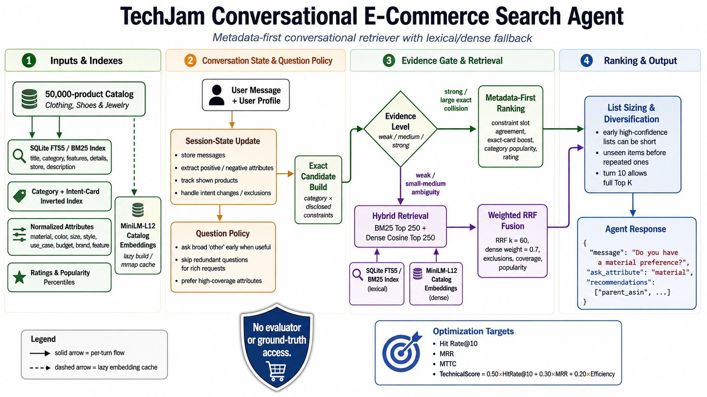

# TechJam Conversational E-Commerce Search Agent

Final submission for the TechJam Conversational E-Commerce Search Challenge. The agent searches a frozen
50,000-product catalog, asks targeted follow-up questions, and returns ranked product recommendations on every
turn. It uses deterministic metadata evidence first and falls back to local lexical and dense retrieval when the
conversation does not identify a sufficiently reliable candidate set.



## Submission summary

| Item | Submission choice |
| --- | --- |
| Agent entry point | `starter.agent.Agent` |
| Dense model | `sentence-transformers/all-MiniLM-L12-v2` |
| Retrieval | Exact metadata intersection, SQLite FTS5/BM25, dense cosine retrieval, weighted RRF |
| Reranking | Constraint agreement, exclusions, sequence agreement, coverage, popularity, and rating |
| Conversation policy | Session-aware, candidate-aware attribute selection with intent-reset handling |
| Execution | Fully local after the catalog, model, and embedding cache are prepared |
| External model API | None |
| Reported API tokens | 0 prompt tokens and 0 completion tokens |
| Estimated API cost | USD 0 |
| Accelerator | CUDA when available; CPU fallback supported |

## Reproduce the submission

### Requirements

- [Pixi](https://pixi.sh/latest/installation/)
- Git
- Network access for the first catalog and model download
- Optional NVIDIA GPU and driver for CUDA acceleration

Python and native dependencies are pinned by `pixi.toml` and `pixi.lock`. Run all commands from the repository
root so Pixi activates the correct Python, BLAS, PyTorch, and CUDA libraries.

```bash
pixi install
pixi run download-data
pixi run runtime-check
pixi run check
pixi run evaluate
```

`pixi run download-data` downloads the frozen catalog, checks its published SHA-256 digest, extracts it to
`data/catalog.jsonl`, and validates all 50,000 rows. `pixi run evaluate` invokes the official local harness and
writes the complete development result to the ignored file `results.json`.

The first semantic retrieval downloads MiniLM-L12 and builds normalized embeddings for the catalog. This is the
slow path and displays a progress bar. Later runs memory-map the matching float32 cache from
`.cache/bert_embeddings/`. Exact metadata retrieval can answer without loading the dense model.

### Runtime configuration

| Environment variable | Default | Purpose |
| --- | --- | --- |
| `BERT_MODEL_NAME` | `sentence-transformers/all-MiniLM-L12-v2` | Override the dense encoder |
| `BERT_BATCH_SIZE` | `128` | Embedding batch size |
| `BERT_DEVICE` | auto | Force `cuda` or `cpu` |
| `HF_HUB_OFFLINE` | unset | Set to `1` to prohibit Hugging Face downloads |
| `TRANSFORMERS_OFFLINE` | unset | Set to `1` to prohibit Transformers downloads |

For example:

```bash
BERT_DEVICE=cuda BERT_BATCH_SIZE=128 pixi run evaluate
```

The selected device is printed at startup:

```text
[BERT] using device: cuda
```

### Offline execution

This submission does not call a hosted inference API. A network connection is needed only when the catalog or
MiniLM model is not already available locally. Before running in a network-restricted environment, prepare:

1. the validated `data/catalog.jsonl` file;
2. the Hugging Face files for the exact `BERT_MODEL_NAME`;
3. the matching `.cache/bert_embeddings/catalog-*.npy` file generated from the same catalog and model.

Then verify the CPU-only offline path with:

```bash
pixi run evaluate-offline-cpu
```

Offline mode fails with an explicit error when either the model artifact or compatible embedding cache is missing;
it does not silently access the network or switch models.

## Method

### 1. Startup indexing

The agent reads the catalog once and builds reusable in-memory structures:

- a weighted SQLite FTS5 index over title, categories, features, details, store, and description;
- normalized product text and extracted material, color, size, style, use-case, budget, brand, and feature values;
- category and intent-card inverted indexes for fast exact intersections;
- ordered metadata constraint sequences for structural reranking;
- category-normalized review-count percentiles and average ratings for stable tie-breaking.

Dense catalog embeddings are loaded lazily. The embedding cache identity includes the catalog and model
configuration, preventing accidental reuse across incompatible models.

### 2. Conversation state and intent changes

Each session tracks messages, positive and negative requirements, answered attributes, exclusions, superseded
preferences, asked questions, and products already shown. A preference correction removes only the replaced value.
A genuine `start over` request clears the complete session state, including the previous category and recommendation
history.

### 3. Candidate-aware questions

The first simulator-shaped turn normally uses a broad `other` question to reveal the most useful hidden condition.
An information-rich free-form request skips that redundant question. Later questions favor high-value attributes
such as feature and material, while coverage and value diversity in the current BM25 Top 30 determine which
attribute can best reduce ambiguity. The agent avoids repeating exhausted questions.

### 4. Metadata-first retrieval

The agent intersects the detected category with all disclosed catalog-backed constraints and estimates the evidence
as weak, medium, or strong. Strong evidence and large exact collision sets use deterministic metadata ranking and
can bypass the dense model. This branch uses constraint-slot agreement, longest common subsequence, constraint
span, retrieval relevance, within-category popularity, average rating, and a stable row-order tie-break.

### 5. Hybrid fallback

When exact evidence is insufficient, the agent retrieves:

- the top 250 lexical candidates from weighted BM25; and
- the top 250 semantic candidates from full-catalog MiniLM cosine similarity.

Weighted reciprocal-rank fusion combines both lists with `k=60` and dense weight `0.7`. The fused ranking then
applies negative-constraint filtering, exact-card support, positive-term coverage, and a deliberately small
within-category popularity prior. If noisy exclusions remove every candidate, the agent retains the unfiltered
ranking rather than returning no recommendations.

### 6. List sizing and cross-turn coverage

A unique high-confidence match may return one product, while an early ambiguous turn normally returns two.
Collision sets expand according to the number of unseen candidates and turns remaining. The final turn can return
the full requested Top K. Products not shown before are ranked ahead of repeats, improving cumulative recall while
keeping early lists precise.

## Main parameters

| Parameter | Value |
| --- | ---: |
| BM25 candidate count | 250 |
| Dense candidate count | 250 |
| RRF `k` | 60 |
| Dense RRF weight | 0.7 |
| Positive-term coverage weight | 0.01 |
| Exact-card support weight | 1.0 |
| Popularity tie-break weight | 0.00025 |
| Early recommendation count | 2 |
| Embedding batch size | 128 |

## Agent API

The official evaluator imports `Agent` from `starter/agent.py`.

```python
class Agent:
    def reset(self, session_id: str, user_profile: dict) -> None:
        ...

    def respond(
        self,
        session_id: str,
        user_message: str,
        turn: int,
        top_k: int,
    ) -> dict:
        return {
            "message": "Do you have a material preference?",
            "ask_attribute": "material",
            "recommendations": [{"parent_asin": "B000..."}],
            "usage": {"prompt_tokens": 0, "completion_tokens": 0},
        }
```

`ask_attribute` is one of `category`, `material`, `color`, `size`, `style`, `brand`, `budget`, `feature`,
`use_case`, `other`, or `null`. Recommendations are unique catalog `parent_asin` values ordered from best to worst.

## Development-set result

The latest local run in `results.json` used the official 200-session public evaluator and the current L12 agent
code. These are development metrics, not an estimate or guarantee of the private evaluation score.

| Metric | Result |
| --- | ---: |
| Sessions | 200 |
| Hit Rate@10 | 1.000000 |
| MRR | 0.901173 |
| MTTC | 2.105 |
| Efficiency | 0.8895 |
| Recommended technical score | 0.948252 |
| Reported tokens | 0 |

The score is calculated by the unchanged official evaluator:

```text
TechnicalScore = 0.50 * HitRate@10 + 0.30 * MRR + 0.20 * Efficiency
Efficiency = clip((11 - MTTC) / 10, 0, 1)
```

Because the public sessions influenced development, a separate pseudo-private audit is available. It excludes all
200 public target ASINs and includes a deliberately difficult high-collision slice:

```bash
pixi run evaluate-robustness
```

Its methodology and limitations are documented in
[`docs/robustness_evaluation.md`](docs/robustness_evaluation.md). The stress slice is diagnostic and must not be
reported as a private-score estimate.

## Integrity boundary

The production agent reads only the catalog, its own caches, the supplied user profile, and messages received
through the public Agent API. It does not import the evaluator, read `data/public_set.jsonl`, inspect
`ground_truth`, or modify scoring. The evaluator, public labels, scoring configuration, and API contract remain
separate from the agent implementation.

The policy does recognize structured phrases emitted by the released deterministic simulator and reconstructs
the published metadata-to-intent-card ordering. This is an explicit protocol optimization and a possible source of
public-set overfitting; it is not access to evaluator state or target labels.

## Resource and cost disclosure

- **Inference:** local PyTorch/Sentence Transformers; no hosted model calls.
- **Token usage:** always reported as zero because there is no token-billed API.
- **API cost:** USD 0 per session.
- **Latency:** metadata-only turns avoid the encoder. The first dense path includes model loading and potentially a
  one-time 50,000-product embedding build; this is hardware-dependent and can take tens of minutes on CPU. Cached
  runs memory-map the catalog matrix and are substantially faster.
- **GPU memory:** workload depends on PyTorch, model, batch size, and hardware. `BERT_BATCH_SIZE` can be lowered when
  memory is constrained.
- **Network:** required for first-time artifact preparation, not for a fully prepared evaluation environment.

## Limitations

- **Heavy dependence on the released conversation format:** the current policy is optimized around the simulator's
  opening templates, reply markers, turn structure, and `ask_attribute` protocol. Much of the public-set performance
  depends on recognizing this format. Free-form users, paraphrased replies, reordered disclosures, or a different
  dialogue protocol may produce substantially lower retrieval quality and later target discovery.
- Attribute extraction is regex- and catalog-driven, so unfamiliar synonyms or non-English requests may rely more
  heavily on dense retrieval.
- Exact metadata may produce large collision groups that cannot all be shown within ten turns.
- Popularity and rating are weak tie-breakers, not personalized preference signals.
- Dense retrieval performs an exact full-catalog cosine scan. It is simple and reproducible but less scalable than
  an approximate nearest-neighbor index for much larger catalogs.
- The local model and catalog cache must be prepared before fully offline scoring.

## Repository layout

| Path | Purpose |
| --- | --- |
| `starter/agent.py` | Submitted agent implementation |
| `pixi.toml`, `pixi.lock` | Reproducible environment and commands |
| `docs/assets/system-architecture.png` | Architecture diagram |
| `evaluator/local_evaluator.py` | Official public simulator and scorer |
| `docs/agent_api_contract.json` | Machine-readable Agent API |
| `docs/evaluation_config.json` | Official metric configuration |
| `data/public_set.jsonl` | Public development sessions; never read by the Agent |
| `scripts/data.py` | Catalog download and validation |
| `scripts/evaluate_robustness.py` | Unseen-target robustness audit |
| `tests/` | Agent, evaluator, data, and robustness tests |

## Data attribution

The catalog and sessions are derived from Amazon Reviews 2023 by McAuley Lab, UCSD. See
[`DATA_ATTRIBUTION.md`](DATA_ATTRIBUTION.md) before using or redistributing the data.
