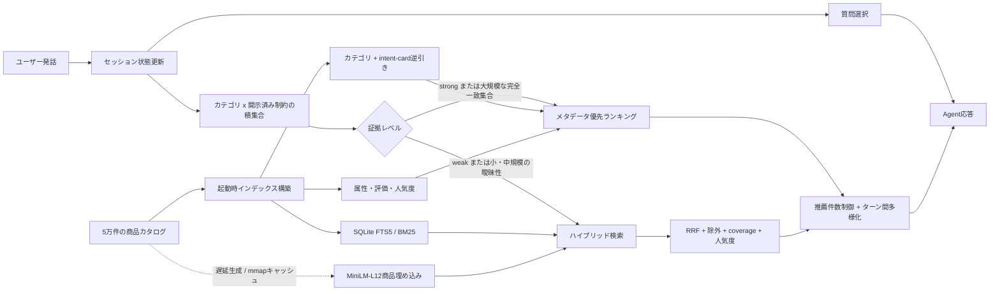

# TechJam Conversational E-Commerce Search Challenge

[English README](README.md)

## これは何をする課題か

50,000商品の固定カタログから、顧客が意図している1商品を最大10ターン以内に見つける
会話型商品検索エージェントを作る課題です。

各セッションには、開始前から正解商品が1つ決められています。Agentは顧客役に属性を質問しながら、
毎ターン最大10件の `parent_asin` を順位付きで推薦します。推薦Top 10に正解商品の
`parent_asin` が入ると、そのターンでセッションが終了します。

## 顧客役は何を返すのか

公開ローカル評価器の顧客役はLLMではなく、正解商品のメタデータから作られた
`intent_card` に基づく決定的なシミュレータです。Agentが書いた自然言語の質問を意味解析するのではなく、
構造化された `ask_attribute` を見て返答内容を選びます。

### セッション開始時

顧客役は正解商品のカテゴリとシナリオに応じた英語メッセージを返します。

| シナリオ | 最初の返答 |
| --- | --- |
| `buying` | 商品カテゴリとhard constraintを1つ開示 |
| `browsing` | 商品カテゴリだけを示し、まだ検討中と返答 |
| `intent_override` | 商品カテゴリと、後で撤回する古い希望を提示 |
| `boundary` | `browsing` と同様に曖昧な状態から開始 |

例：

```text
I'm looking for Shoes. A key requirement is: leather.
```

### 2ターン目以降

Agentは次のように、質問したい属性を1つ指定します。

```python
{
    "message": "Do you have a material preference?",
    "ask_attribute": "material",
    "recommendations": [{"parent_asin": "B000..."}]
}
```

利用できる属性は次のとおりです。

```text
category, material, color, size, style, brand,
budget, feature, use_case, other, null
```

顧客役の返答規則は次のとおりです。

- `ask_attribute` と一致する未開示の条件があれば、最大2つ開示する
- 一致する条件がなければ「その属性について追加の希望はない」と返す
- `ask_attribute` が `null` なら、具体的な属性を質問するよう要求する
- `boundary` では最初の具体的な属性質問に対して「希望なし」と返す
- `intent_override` ではターン3または4に、以前の希望を撤回して新しい条件を伝える

例えば `material` を質問して未開示条件に `cotton` があれば、次のような返答になります。

```text
For that, what matters is: cotton.
```

Agentの `message` は顧客向け表示として必要ですが、公開シミュレータがどの情報を開示するかは
`message` ではなく `ask_attribute` で決まります。質問と商品推薦は同じターンに実行できます。

## 正解商品はどこから選ばれるか

「各ターンで50,000商品から顧客役がランダムに1つ選ぶ」という仕組みではありません。
セッションごとに正解商品が事前に固定されています。

公開開発セットでは、[data/public_set.jsonl](data/public_set.jsonl) の各行に次のように入っています。

```json
{
  "sample_id": "public_0001",
  "scenario_type": "buying",
  "user_profile": {"...": "..."},
  "ground_truth": {"parent_asin": "B09PYB7B6Z"}
}
```

公開セットは200セッション・200種類の重複しない正解商品で、すべて50,000商品カタログに存在します。
最終評価では別の800セッションが使われ、`ground_truth`、intent card、シナリオ内部状態は
Agentに渡されません。

ローカル評価器は `ground_truth.parent_asin` でカタログの商品を引き、その商品から次の情報を生成します。

- 商品のカテゴリから最初の大まかな商品カテゴリ
- `features` と `details` からhard constraintとsoft preference
- 商品テキスト中の代表的な素材・色
- 値がある場合は価格条件
- `intent_override` の古い希望、新しい希望、上書きターン

つまり、顧客役の回答は正解商品のメタデータに結び付いています。ただしAgentが正解IDを直接受け取ることはなく、
会話から得た条件でカタログを検索して推定します。

## 商品データはどれか

検索対象はダウンロード後の `data/catalog.jsonl` です。Amazon Reviews 2023の
`Clothing_Shoes_and_Jewelry` から作られた固定50,000商品で、1行が1商品ファミリーです。

| フィールド | 内容 |
| --- | --- |
| `parent_asin` | 商品ファミリーID。推薦と正解判定に使う唯一のキー |
| `title` | 商品名 |
| `features` | 特徴説明の配列 |
| `description` | 商品説明の配列 |
| `price` | 価格。数値、文字列、または `null` |
| `categories` | カテゴリ階層・タグ |
| `details` | 素材、色、サイズ、部門などの構造化属性 |
| `average_rating` | 平均評価 |
| `rating_number` | 評価件数 |
| `store` | ストア・ブランド名。欠損する場合あり |

概略は次の形式です。

```json
{
  "parent_asin": "B000...",
  "title": "...",
  "features": ["..."],
  "description": ["..."],
  "price": 49.99,
  "categories": ["Clothing", "Shoes", "..."],
  "details": {"Department": "...", "Material": "..."},
  "average_rating": 4.4,
  "rating_number": 120,
  "store": "..."
}
```

`public_set.jsonl` は「会話セッションとローカル採点ラベル」、`catalog.jsonl` は
「Agentが検索・推薦する商品集合」という役割分担です。

## 1セッションの処理フロー

```text
public_setの1行から正解parent_asinを読む（評価器のみ）
            ↓
正解商品のメタデータから顧客の条件を生成
            ↓
reset(session_id, user_profile)
            ↓
顧客役が最初のuser_messageを返す
            ↓
Agentが質問属性 + カタログ内のTop 10商品を返す
            ↓
正解があれば終了／なければ顧客役が次の条件を返す
            ↓
最大10ターンまで繰り返す
```

`respond()` に渡されるのは、そのターンの `user_message`、ターン番号、`top_k=10` です。
過去の会話、抽出済み条件、SQL候補集合などは、Agent側が `session_id` ごとに保存します。

## 現行システム：メタデータ優先ハイブリッド検索

現在の `starter/agent.py` は、**カタログの完全一致メタデータを最優先し、証拠が弱い場合だけ
BM25とMiniLMへフォールバックする会話型検索システム**です。Agentに正解ASIN、`ground_truth`、
評価器の内部状態は渡されません。利用するのは商品カタログとAgent APIから受け取った発話だけです。

### 実行時アーキテクチャ



### 起動時に構築するもの

- title、category、features、details、store、descriptionを対象にした重み付きFTS5インデックス
- 商品ごとの素材、色、サイズ、スタイル、用途、予算、ブランド、特徴の属性集合
- 商品メタデータから生成した順序付きintent-cardと、カテゴリ・制約から商品を引く逆引きインデックス
- カテゴリ内で正規化したレビュー件数パーセンタイルと平均評価
- 必要になった場合だけ生成する `sentence-transformers/all-MiniLM-L12-v2` の正規化埋め込み

完全一致メタデータだけで回答できる場合、MiniLMはロードしません。semantic検索が必要になった時点で
float32の商品埋め込みをバッチ生成し、`.cache/bert_embeddings/` に保存します。以後はmmapで再利用します。

### 各ターンの処理

1. **会話状態を更新する。** 新しい発話を保存し、肯定条件、否定条件、回答済み属性、除外値、上書き済み値、
   過去に推薦したASINを更新します。否定・撤回された語はBM25とdense検索用クエリから除去します。
2. **意図変更を処理する。** 条件の訂正では古い値だけを削除し、後から開示された有効な条件は保持します。
   本当の `start over` では会話、カテゴリ、質問履歴、除外条件、推薦履歴をすべて初期化します。
3. **次の質問を決める。** シミュレータ形式の開始文では、まず `ask_attribute="other"` の広い質問を使います。
   一方、すでに2属性以上を含む自由文では冗長な広い質問を省略します。その後はBM25上位30件について、
   属性のcoverageと値の多様性を計算し、基本的にfeature/materialを優先します。通常会話で質問候補を
   使い切った場合は、同じ質問を繰り返さず推薦結果だけ返します。
4. **完全一致候補を作る。** 検出カテゴリと、会話で開示されたカタログ由来制約の積集合を取り、証拠を
   `weak`、`medium`、`strong` に分類します。早期に推薦件数を絞る評価プロトコル最適化は、カテゴリだけでなく
   公開シミュレータの定型マーカーも確認できた場合に限ります。
5. **検索経路を選ぶ。** strongな証拠、または50件を超える大規模な完全一致集合では、安定したメタデータ順で
   並べ、MiniLMを省略できます。それ以外はBM25上位250件と全商品cosine類似度上位250件をRRFで統合します。
6. **ランキングする。** 完全一致候補では制約スロット一致、LCS、制約間距離、検索スコア、カテゴリ内人気度、
   平均評価を使います。ハイブリッド経路ではさらに除外フィルタ、intent-card boost、正条件coverage、弱い
   人気度priorを適用します。カタログノイズで除外後の候補が0件になる場合だけ、空応答を避けるため除外前へ戻します。
7. **推薦件数と重複を制御する。** strongな一意候補は1件、通常の早期推薦は信頼できる場合2件です。
   完全一致候補が多い場合は、残りターンですべての未表示候補を提示できる件数へ広げます。10ターン目は
   最大Top Kまで返します。既出商品は未表示商品より後ろへ送り、候補不足時だけ再利用します。

### 主要パラメータ

| パラメータ | 既定値 | 役割 |
| --- | ---: | --- |
| BM25候補数 | 250 | lexical候補集合 |
| Dense候補数 | 250 | 全商品cosine検索の候補集合 |
| RRF `k` | 60 | 順位統合の平滑化 |
| Dense RRF重み | 0.7 | BM25重み1.0に対するsemantic寄与 |
| 条件coverage重み | 0.01 | 多くの正条件を満たす商品への加点 |
| Intent-card重み | 1.0 | 完全一致メタデータ候補への加点 |
| 人気度重み | 0.00025 | カテゴリ内の弱いtie-break |
| 早期推薦件数 | 2 | 信頼できる場合の狭い推薦リスト |
| 埋め込みバッチサイズ | 128 | `BERT_BATCH_SIZE` で変更可能 |

### 評価プロトコルへの適合と境界

完全一致経路は、公開シミュレータの `A key requirement is:`、`For that, what matters is:`、
`What I need is:` を認識し、公開されているメタデータからintent-cardを作る順序も再現します。
これは公開セットで強い一方、定型文や生成規則への過適合リスクがあります。そのため、言い換え、未知の条件、
カテゴリ欠損、積集合0件ではBM25＋MiniLMへ戻します。また、公開200ターゲットを除外した
`pixi run evaluate-robustness` で別途監査できます。

変更可能範囲は明確です。`starter/agent.py` はカタログと発話を使いますが、評価器をimportせず、
`data/public_set.jsonl` や `ground_truth` を実行時に読みません。公式評価器、公開ラベル、評価設定、
Agent API契約は `origin/main` とバイト単位で一致しています。

### 画像生成用の構成仕様

後でアーキテクチャ画像を生成する場合は、横長の4領域構成にします。

1. 左：**入力と起動時インデックス** — 商品カタログ、FTS5、intent-card逆引き、MiniLMキャッシュ
2. 中央左：**会話状態と質問方針** — 発話、属性抽出、否定・上書き処理、質問選択
3. 中央右：**証拠ゲートと2経路** — `weak / medium / strong` の分岐、緑のメタデータ経路、紫のBM25＋MiniLM経路
4. 右：**ランキングと出力** — RRF、制約・人気度、推薦件数、重複抑制、Agent応答

実線は各ターンのデータフロー、破線は埋め込みの遅延ロードとキャッシュ再利用にします。会話状態はアンバー、
メタデータ経路は緑、semantic fallbackは紫、最終推薦は青で表現し、図の下部に
`No evaluator or ground-truth access` と書いた盾アイコンを置きます。

モデルとバッチサイズは次のように上書きできます。

```bash
BERT_MODEL_NAME=sentence-transformers/all-MiniLM-L12-v2 BERT_BATCH_SIZE=128 pixi run evaluate
```

ローカルモデルなのでAPIトークン使用量は0です。CUDAが利用可能なら自動的にCUDAを選択し、利用できない場合は
CPUへフォールバックします。`BERT_DEVICE=cuda` または `BERT_DEVICE=cpu` で明示的に変更できます。

```bash
pixi run python -c "import torch; print(torch.version.cuda, torch.cuda.is_available())"
```

## セットアップと実行

[Pixiをインストール](https://pixi.sh/latest/installation/)し、リポジトリルートで実行します。

```bash
pixi install
pixi run download-data
pixi run data-info
pixi run check
pixi run evaluate
```

`pixi run download-data` は公式Releaseからカタログを取得し、SHA-256を検証して
`data/catalog.jsonl` に展開します。ファイルは大きいためGit管理対象外です。

主なPixiタスク：

| タスク | 内容 |
| --- | --- |
| `pixi run download-data` | 商品カタログをダウンロード・検証・展開 |
| `pixi run data-info` | 行数、シナリオ数、フィールド型を表示 |
| `pixi run validate-data` | 公開セットとカタログを検証 |
| `pixi run test` | ユニットテストを実行 |
| `pixi run check` | テストと全データ検証を実行 |
| `pixi run runtime-check` | Python、NumPy/BLAS、Torch、デバイスを確認 |
| `pixi run evaluate` | 公開200セッションでAgentを評価 |
| `pixi run evaluate-robustness` | 公開ターゲットを除外した40セッションの監査 |
| `pixi run evaluate-offline-cpu` | オフライン・CPU固定で評価 |

## 評価指標

- Hit Rate@10: 10ターン以内に正解したセッションの割合
- MRR: 最初に正解したターンにおける正解商品の順位の逆数平均
- MTTC: 最初に正解したターン。失敗は11ターンとして計算
- Efficiency: `(11 - MTTC) / 10` を0〜1に制限

```text
TechnicalScore = 0.50 × HitRate@10 + 0.30 × MRR + 0.20 × Efficiency
```

## 関連ファイル

| ファイル | 内容 |
| --- | --- |
| [starter/agent.py](starter/agent.py) | メタデータ優先・BM25/MiniLM fallbackのAgent |
| [evaluator/local_evaluator.py](evaluator/local_evaluator.py) | 顧客シミュレータと採点処理 |
| [docs/competition_specification.md](docs/competition_specification.md) | 競技仕様 |
| [docs/agent_api_contract.json](docs/agent_api_contract.json) | Agent APIの機械可読スキーマ |
| [docs/evaluation_config.json](docs/evaluation_config.json) | ターン数、Top K、評価式 |
| [data/README.md](data/README.md) | データフィールドと取得方法 |
